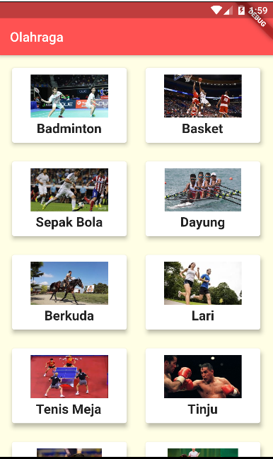
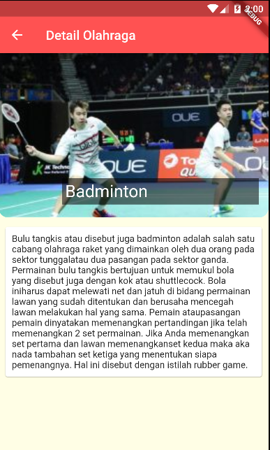

# Flutter Project "Olahraga" (Tugas 3 - OSG05)

## Screenshoot

## Built With
- Flutter
- SingleChildScrollView

## Created By
- Hartanto Santoso

## Online Study Group Eudeka!
salah satu course dari Eudeka yang belajar tentang membuat aplikasi yang bersifat hybrid dengan Flutter

## OSG05 - Flutter Basic
Dengan jangka waktu lebih kurang 2 bulan, peserta diharapkan dapat mengenal dan membuat aplikasi simple Flutter dengan menggunakan data dari internet (API).

## Cara Mendaftar Online Study Group
Untuk pendaftaran kelas selanjutnya, silahkan kunjungi atau hubungi kami di bawah ini.

## Info Lebih Lengkap
- Website : www.eudeka.id
- Twitter: @EudekaID
- Telegram : @eudekainfo
- Instagram : @eudeka.id
- WhatsApp : 0895351577557
- Email : info@eudeka.id
